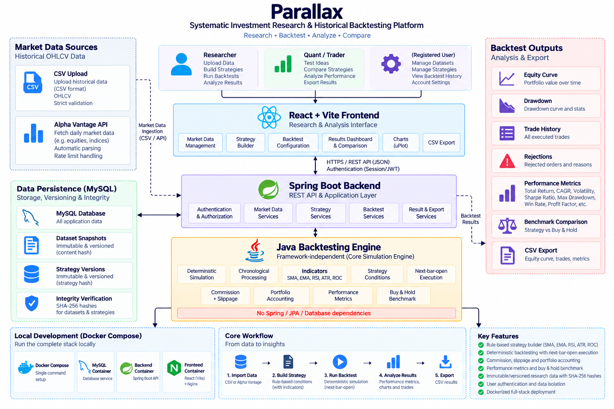

# Parallax

**Parallax** is a systematic investment research and historical backtesting platform.

It allows users to load historical market data, define rule-based trading strategies, run deterministic historical simulations, and analyze portfolio performance, risk, trades, and benchmark results.

Parallax combines a **framework-independent Java backtesting engine** with a **Spring Boot backend** and **React frontend**.

## What Parallax Can Do

### Market Data

Users can create markets and import historical OHLCV data through:

- CSV uploads for custom or long historical datasets
- Alpha Vantage for market-data acquisition

Imported data is stored as **immutable market-data snapshots**, so a backtest can always refer to the exact historical data used for the experiment.

### Strategy Building

Users can create rule-based trading strategies using technical indicators and logical conditions.

Currently supported indicators:

- **SMA** — Simple Moving Average
- **EMA** — Exponential Moving Average
- **RSI** — Relative Strength Index
- **ATR** — Average True Range
- **ROC** — Rate of Change

Strategies define:

- Entry conditions
- Exit conditions
- Position sizing

Example:

```text
Entry: SMA(20) > SMA(50)
Exit:  SMA(20) < SMA(50)
```

### Historical Backtesting

Users can run a strategy against a selected market snapshot and historical date range.

The engine processes market data chronologically and:

- Generates trading signals
- Schedules orders for future execution
- Executes orders on the next bar's open
- Applies commission and slippage
- Manages cash and holdings
- Records trades and portfolio value
- Handles orders that cannot be executed

The engine is designed to avoid **look-ahead bias** and produce deterministic results for the same inputs.

### Portfolio & Trade Analysis

Each backtest records the simulated portfolio throughout the testing period.

Users can inspect:

- Cash and holdings
- Equity over time
- Individual trades
- Open and closed trades
- Realized and unrealized P&L
- Commission and slippage
- Order rejections

### Performance Analysis

Parallax calculates key performance and risk measures including:

- Total Return
- CAGR
- Volatility
- Sharpe Ratio
- Maximum Drawdown
- Win Rate
- Average Win / Loss
- Profit Factor
- Trading Costs

Results are presented through:

- Equity curve
- Drawdown chart
- Trade analysis
- Performance summary

### Benchmark Comparison

Every backtest includes a **buy-and-hold benchmark** for the same market and period.

This allows users to compare the historical strategy result with simply buying and holding the underlying security.

### Reproducible Research

Strategies, market-data snapshots, and backtest results are versioned and immutable.

A backtest records the specific:

- Strategy version and hash
- Market-data snapshot and hash
- Backtest configuration
- Engine semantics version

Persisted results are verified when they are read back, helping detect inconsistent or corrupted research data.

### Result Export

Users can export backtest results as CSV for further analysis outside the application.

Available exports include:

- Equity curve
- Trade history

## Tech Stack

**Engine:** Java 21  
**Backend:** Spring Boot, PostgreSQL  
**Frontend:** React, Vite  
**Testing:** JUnit, Testcontainers, Vitest

## Architecture



The backtesting engine is framework-independent and does not depend on Spring, JPA, or PostgreSQL.

For the detailed architecture and design decisions:

- [`docs/architecture.md`](docs/architecture.md)
- [`docs/decisions.md`](docs/decisions.md)

## Running Locally

### Option 1 — Docker

The complete application can be started using Docker Compose.

From the repository root:

```bash
docker compose up --build
```

Then open:

```text
http://localhost:3000
```

Stop the application with:

```bash
docker compose down
```

PostgreSQL data is persisted using the Docker volume defined by the Compose setup.

### Option 2 — Run Manually

#### Prerequisites

- Java 21
- Node.js
- PostgreSQL

#### Backend

Create the local PostgreSQL database:

```sql
CREATE ROLE parallax WITH LOGIN PASSWORD 'parallax';
CREATE DATABASE parallax OWNER parallax;
```

Then, from the repository root:

```bash
./mvnw install -DskipTests
./mvnw -pl backend spring-boot:run
```

#### Frontend

```bash
cd frontend
npm install
npm run dev
```

The frontend proxies `/api` requests to the backend.

### Authentication

Authentication is enabled locally.

For a fresh environment, either register a new account through the application's **Register** page or claim the existing `dev` account by providing:

```text
PARALLAX_CLAIM_USERNAME=dev
PARALLAX_CLAIM_PASSWORD=<15+ characters>
```

The claim password is only used to set the password for an existing passwordless account.

### Alpha Vantage

To enable Alpha Vantage imports, provide:

```text
ALPHA_VANTAGE_API_KEY=<your-key>
```

The application can still run without an Alpha Vantage key; only Alpha Vantage imports require it.

## Testing

### Backend

```bash
./mvnw verify
```

Backend integration tests use **Testcontainers** and require Docker.

### Frontend

```bash
cd frontend
npm test
npm run lint
npm run build
```

## Project Structure

```text
parallax/
├── engine/       # Framework-independent backtesting engine
├── backend/      # Spring Boot application and REST API
├── frontend/     # React research interface
├── docs/         # Architecture and design decisions
├── compose.yaml  # Docker Compose setup
└── pom.xml       # Maven multi-module build
```
